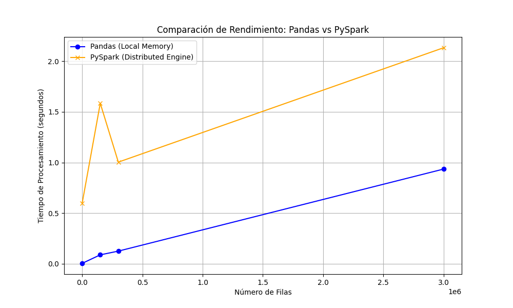

# PySpark vs. Pandas — Salary Data Analysis & Benchmark

Analysis of a salary dataset implemented **twice** — with **Pandas** and with **PySpark** — plus a
performance benchmark comparing both engines. Runnable locally or fully containerized with Docker.

**Stack:** PySpark · Pandas · Matplotlib · Docker · Docker Compose

## Why two execution methods?

1. **Local (Python + Java):** ideal for active development — your IDE, autocompletion, and
   step-by-step debugging with no image-build time. Requires Java and Spark configured on your machine.
2. **Docker (containerized):** portability and stability — identical Java/Python/library versions on
   any OS, closer to a production/cluster environment. Slightly slower feedback loop when rebuilding.

## Project structure

```
taller_pyspark/
├── main.py               # Pandas + PySpark logic and benchmark
├── data.csv              # salary dataset
├── benchmark.png         # generated Pandas-vs-PySpark timing comparison
├── Dockerfile
├── docker-compose.yml    # mounts the working dir as a volume
└── requirements.txt      # local dependencies
```

## How to run

### Option A — Local

```bash
# Requires Java (JDK 11+)
python3 -m venv .venv && source .venv/bin/activate
pip install -r requirements.txt
python3 main.py
```

### Option B — Docker (recommended)

The compose file mounts the current folder into the container, so edits to `main.py` don't require
an image rebuild:

```bash
docker compose up
```

Or manually:

```bash
docker build -t pyspark-app .
docker run -v "$(pwd)":/app pyspark-app
```

## Output

`main.py` runs the analysis with both engines and produces `benchmark.png`, a bar chart comparing
Pandas vs. PySpark execution time on the same workload.



---
**Course:** Networks & Infrastructure (REI) — Data Engineering & AI, Universidad Autónoma de Occidente.
